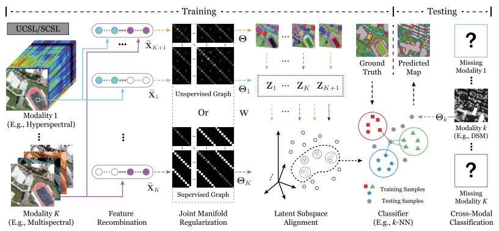

# UCSL

Code for the TGRS paper [UCSL: Toward Unsupervised Common Subspace Learning for Cross-Modal Image Classification](https://ieeexplore.ieee.org/abstract/document/10144390).

An unsupervised common subspace feature learning method for cross-modal remote sensing image classification.

A joint work with [Danfeng Hong](https://github.com/danfenghong).

Users can manually download the Houston 2013 datasets on https://pan.baidu.com/s/1Sg7HM7wDykjskwcXP8VWvA?pwd=wnfr using key: wnfr.

Citation
---------------------

**Please kindly cite the papers if this code is useful and helpful for your research.**

Jing Yao, Danfeng Hong, Haipeng Wang, Hao Liu, Jocelyn Chanussot. UCSL: Toward Unsupervised Common Subspace Learning for Cross-Modal Image Classification, IEEE Transactions on Geoscience and Remote Sensing, 2023, vol. 61, pp. 1-12, Art no. 5514212, doi: 10.1109/TGRS.2023.3282951. 

    @article{yao2023ucsl,
      title={UCSL: Towards unsupervised common subspace learning for cross-modal image classification},
      author={Yao, Jing and Hong, Danfeng and Wang, Haipeng and Liu, Hao and Chanussot, Jocelyn},
      journal={IEEE Transactions on Geoscience and Remote Sensing},
      year={2023},
      volume={61},
      pages={1-12},
      note={DOI: 10.1109/TGRS.2023.3282951}
      publisher={IEEE}
    }
